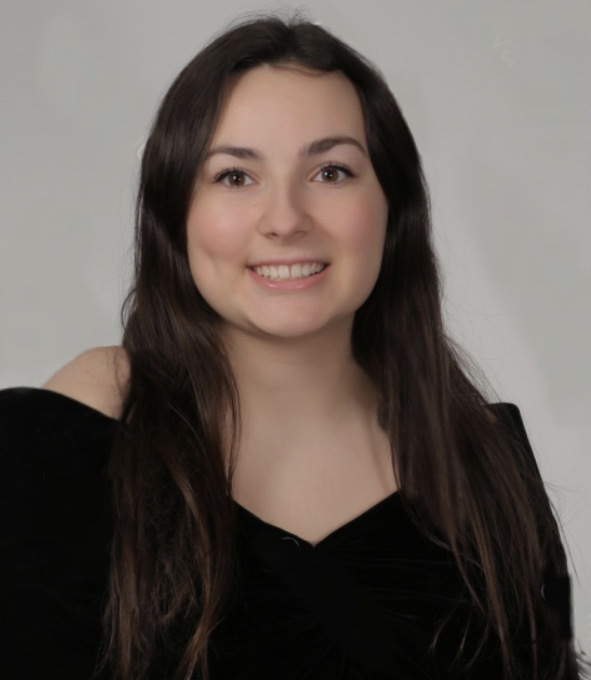

# Open Source Software - Spring 2021
## Christine Koulopoulos

## Bio
Hello! I'm Christine, I'm a senior Computer Science and Math dual major. I like to do jigsaw puzzles and watch New Girl on Netflix.

Discord: christinekoul

## Lab Reports
* [Lab 1](https://github.com/christinekoul/oss-repo/blob/master/labs/lab-01/lab01.md)
* [Lab 2](https://github.com/christinekoul/oss-repo/blob/master/labs/lab-02/lab2.md)
* [Lab 3](https://github.com/christinekoul/oss-repo/blob/master/labs/lab-03/lab3.md)
* [Lab 4](https://github.com/christinekoul/oss-repo/blob/master/labs/lab-04/lab4.md)
* [Lab 5](https://github.com/christinekoul/oss-repo/blob/master/labs/lab-05/lab5.md)
