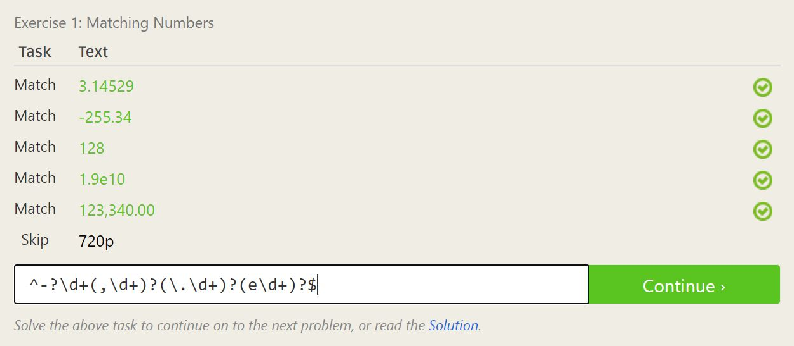
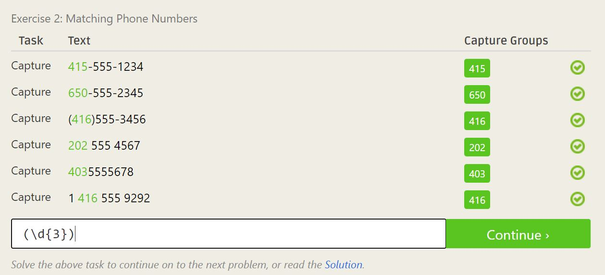
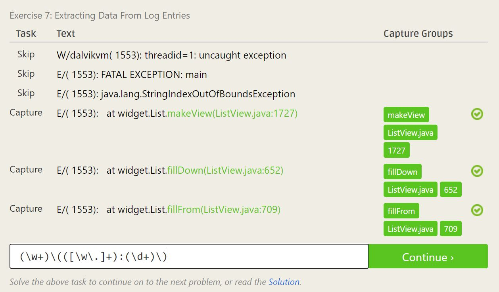
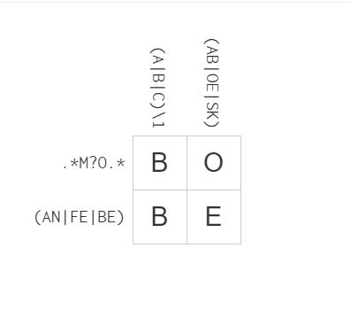

# Lab 01

### 1.4:
Here is a screenshot of my message:

### 2.3:
1. Give examples. If an answer is complex it is usually useful to give an example of how you would apply the solution.
2. Provide resources. Even if you know an answer off-hand it can be useful to point whoever is asking to additional resources that can help them.

### 2.4:
As I read through chapter 3 of Free Culture, I was at first inspired. The idea that someone like Jesse, who doesn't even have experience in programming could create a popular and useful search engine gave me more confidence in my own abilities. I also found it notable that Jesse built off of previously created tools and only had to modify parts to make everything work together. I thought that this was a great example of not reinventing the wheel. However, as I continued reading the story became more of a cautionary tale. It taught me the importance of copyright, licensing, and warned me to be aware of how any of my future projects could be manipulated. While I side with Jesse on the matter, he lacked a sense of responsibility over what his users were doing with his search engine. Overall, this reading taught me to learn from Jesse's mistakes.

### 3:
Here is a screenshot of my directory structure:

### 4.1
Here are screenshots of my solutions:

### 4.2
Here are screenshots of my solutions:

### 5.2
Here is my solution using blockly:

### 6
Looking at the list of Open Source Projects given, I skimmed through the names of projects, reading the introductions to those which interested me. One project that particularly interests me is Moodle (http://aosabook.org/en/moodle.html). What I like most is that it's a web app, because I've always been interested in creating one myself but don't know where to start. I also am interested in how plugins are used, because that is another thing I'm interested in learning about, and how their output is generated with different themes because I find UI design to be particularly exciting.

I've also put some thought into a project that I might like to start from scratch. I often find myself wanting sitting down to watch TV with a group of people and not knowing what to put on that everyone would like. I'd like to solve this problem by creating a tinder-like application that users can create profiles on and then swipe on different movies and tv shows. The idea is that after enough swiping, your profile is linked to a database of entertainment that you've tagged as like or dislike. Then, when you want to watch tv with someone else, you can compare databases with your friends and quickly learn what entertainment you have in common. It could even be taken a step further, and be filtered by genre, length, language, rating, etc. I'm not sure of where to start to implement this, but I have a pretty concrete vision of what it should look like.
