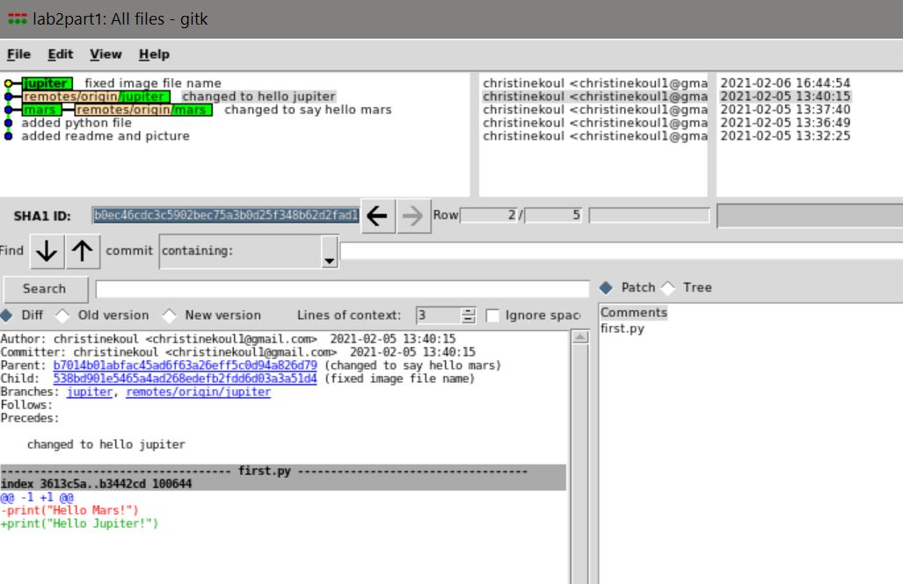
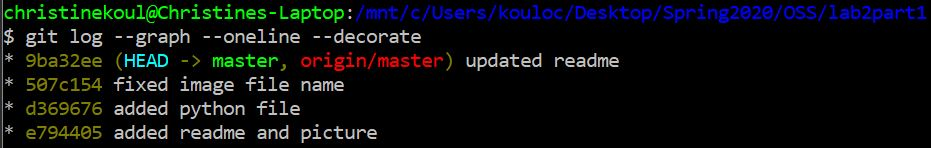
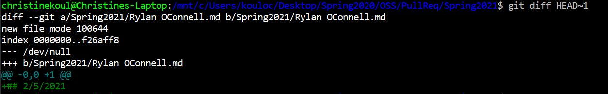

1.2: https://github.com/christinekoul/lab2part1

1.5: gitk is better visually and provides more information about the branching diagram. The git log command is simpler, but provides less information in a harder-to-read format.

gitk: 
git log: 

2.1: https://github.com/christinekoul/Spoon-Knife

2.4: 

3.1: https://github.com/christinekoul/PullReq

3.2 

3.5: https://github.com/joshmalek/OSSProjectIdeas
