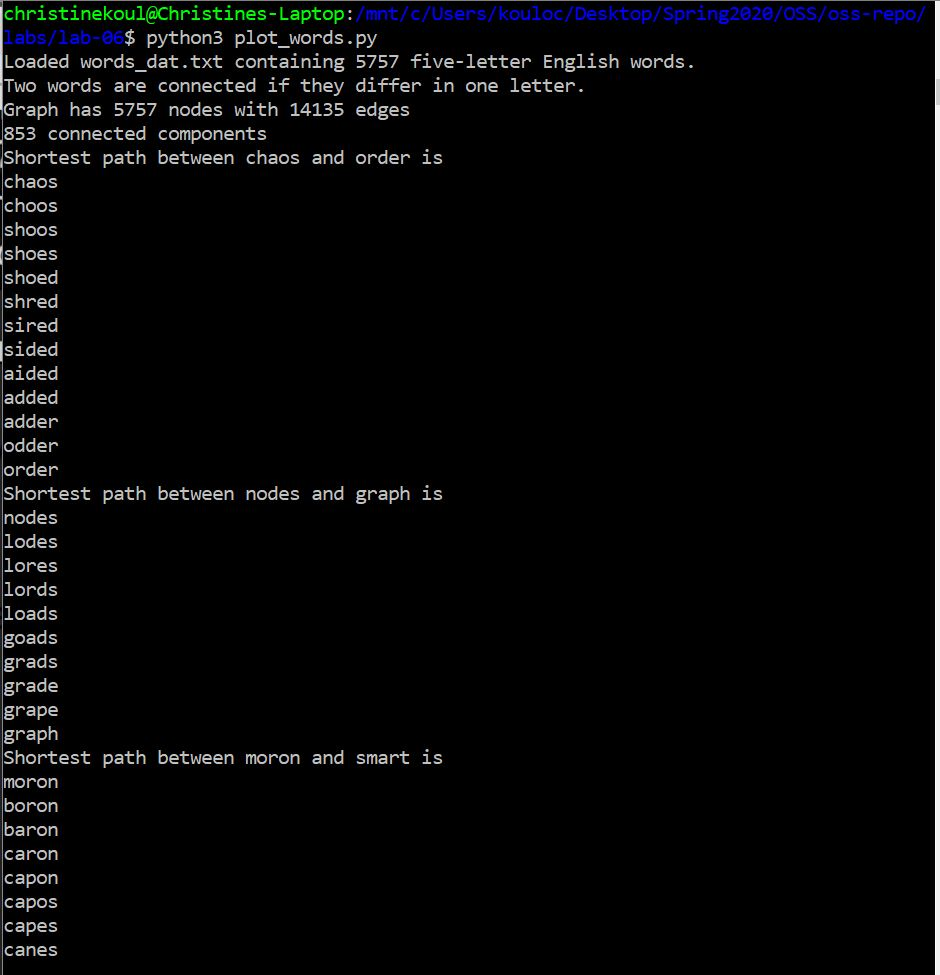
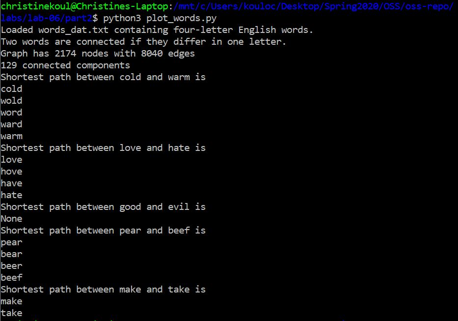
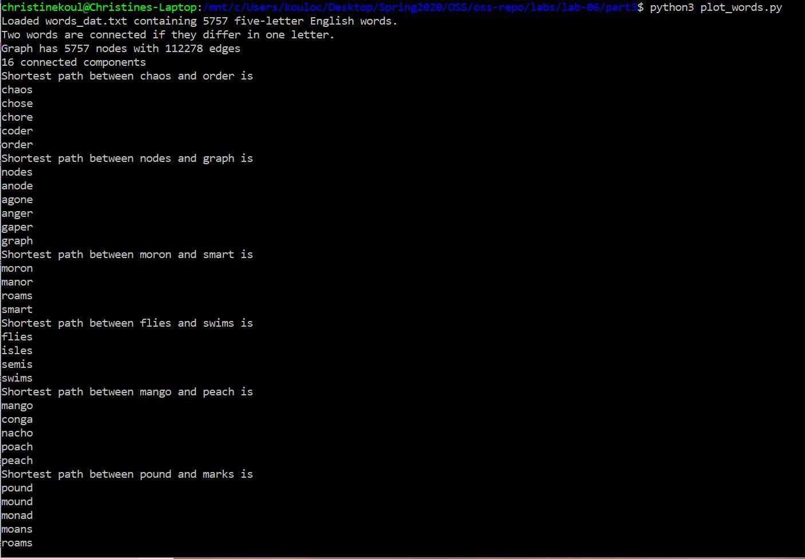

# Lab 06 Report - Christine Koulopoulos

### Step 1

[Part 1 Code](part1/plot_words.py) (changes in lines 78-83)

Results:

### Step 2

[Part 2 Code](part2/plot_words.py) (changes in lines 59, 72, 78-82)

Results:

### Step 3

[Part 3 Code](part3/plot_words.py) (changes in lines 31, 46-47)

Results:

