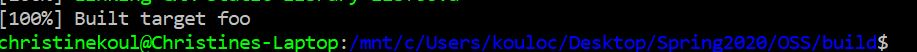
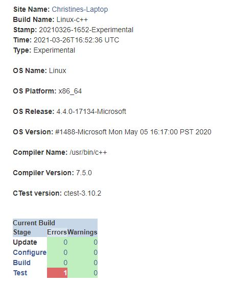
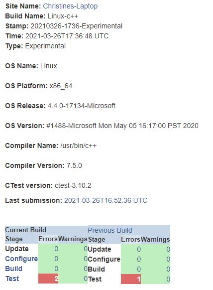
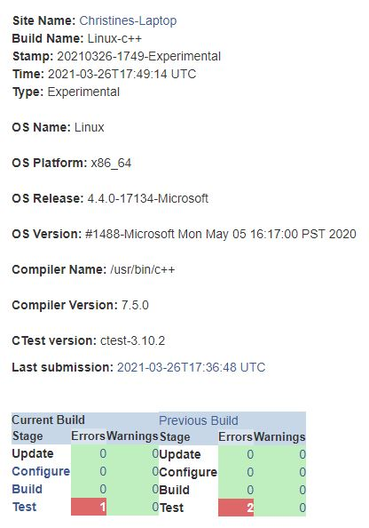
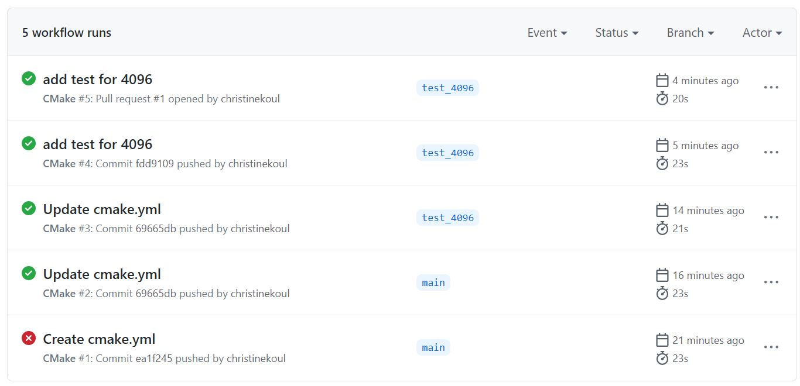
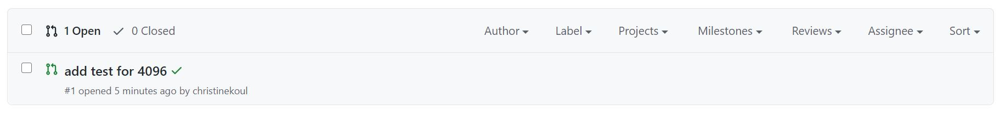
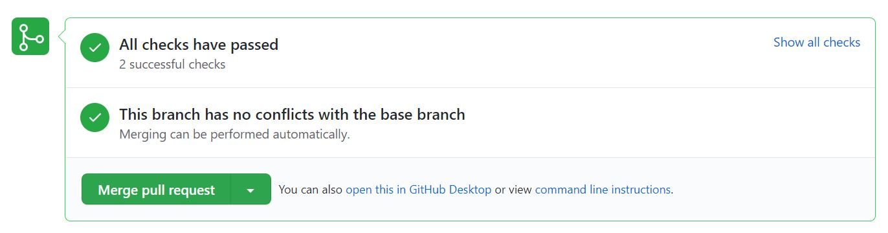

# Lab 07 Report - Christine Koulopoulos

### Checkpoint 1

### Checkpoint 2

1.1: By clicking on a build name and scrolling down to "Tests Summary" on the bottom and clicking that, you can see the tests that are run for that build.
1.2: In the same page as 1.1, if you click on a specific failure it'll bring you to a page that details the test's output. Here you can see the specific error that occurred and gives you information on what went wrong. Here you can see the expected vs actual output, the line number that the error occured, and more. This is helpful for debugging so that you have somewhere to start.
1.3: The dashboard is relatively clean with only 1 error, and no warnings. The test "Module.ExternalData" failed and is unstable. This is a little concerning.

3: There is one error, in the test "kwsys.testSystemTools". Looking further into it, the issue is that SetPermissions failed to set permissions. I'm not sure why this error is occurring and it doesn't seem to be too concerning.

4: 

### Checkpoint 3

3: Test "CMake.Copyright" failed. Based off of the Test output on the dashboard, it failed because of the line "Copyright 2000-2020 Kitware, Inc. and Contributors", since the current version year is 2021, so it's not included. To fix this, I will change "2020" to "2021".
4: 
5: 

In the screenshot it shows one error, but it used to be two. The one error remaining is the one from earlier than I don't know how to fix.

### Checkpoint 4

[Step 5 Repo](https://github.com/christinekoul/CMake-Step5)

