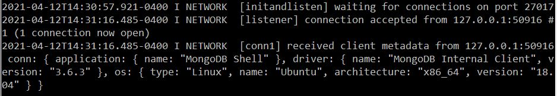
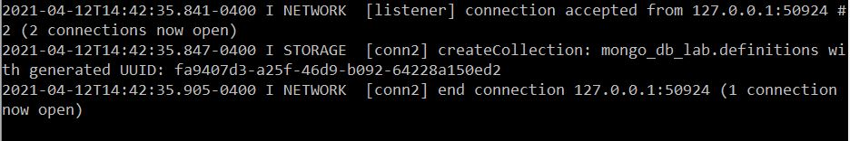
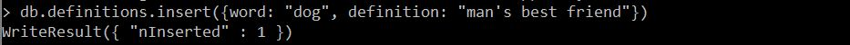
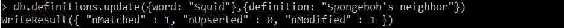
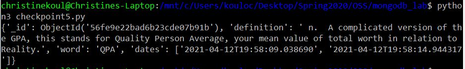

# Lab 09 Report - Christine Koulopoulos

### Checkpoint 0

Recently the Supreme Court ruled on the copyright ability of APIs. They found that Google could legally use elements of Oracle's Java API. The reasoning for this being that Google used only what was needed and used it to create something new, rather than a knockoff product. I agree with this reasoning to not allow APIs to be copyrighted. The purpose of API code is to enable creative expression, so allowing an API to be under copyright would negate that quality.

### Checkpoint 1

### Checkpoint 2

### Checkpoint 3

Output from `git diff [here](diff.txt).

### Checkpoint 4

[Python script](checkpoint4.py)
[Output](checkpoint4output.txt)

### Checkpoint 5

The word "QPA" was the first to update randomly twice.

[Python script](checkpoint5.py)
[Output](checkpoint5output.txt)
