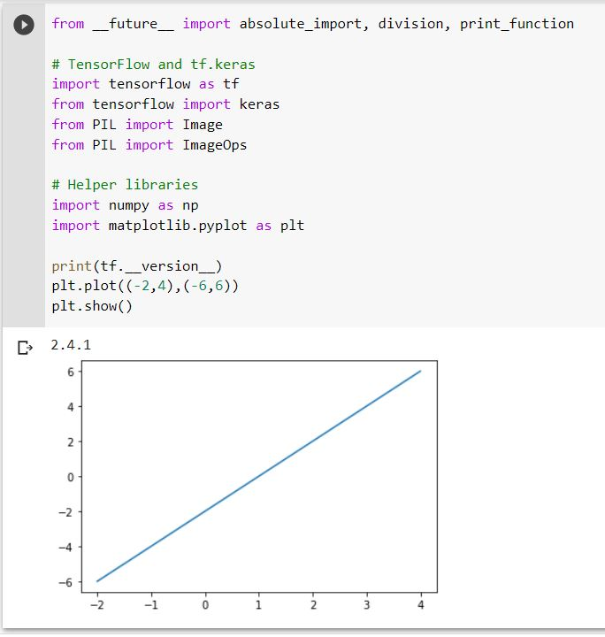
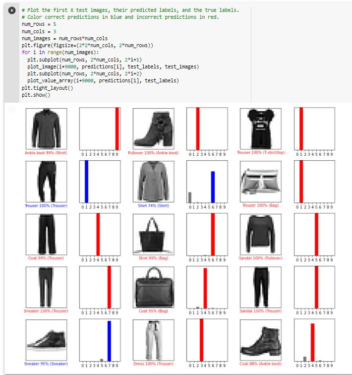

# Lab 10 Report - Christine Koulopoulos

### Checkpoint 1

### Checkpoint 2

### Checkpoint 3

1. 

`[[1.0000000e+00 0.0000000e+00 0.0000000e+00 0.0000000e+00 0.0000000e+00
  0.0000000e+00 2.5720484e-37 0.0000000e+00 0.0000000e+00 0.0000000e+00]] 6 Shirt`

2. 

`[[0. 0. 0. 1. 0. 0. 0. 0. 0. 0.]] 3 Dress`

3. 

`[[0. 0. 0. 0. 0. 0. 0. 0. 1. 0.]] 8 Bag`
